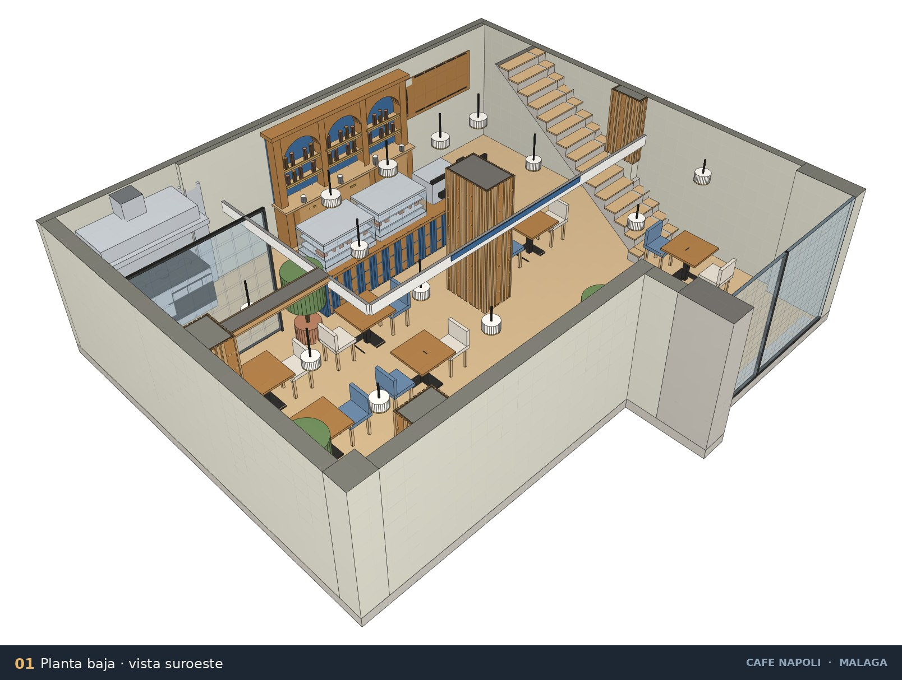
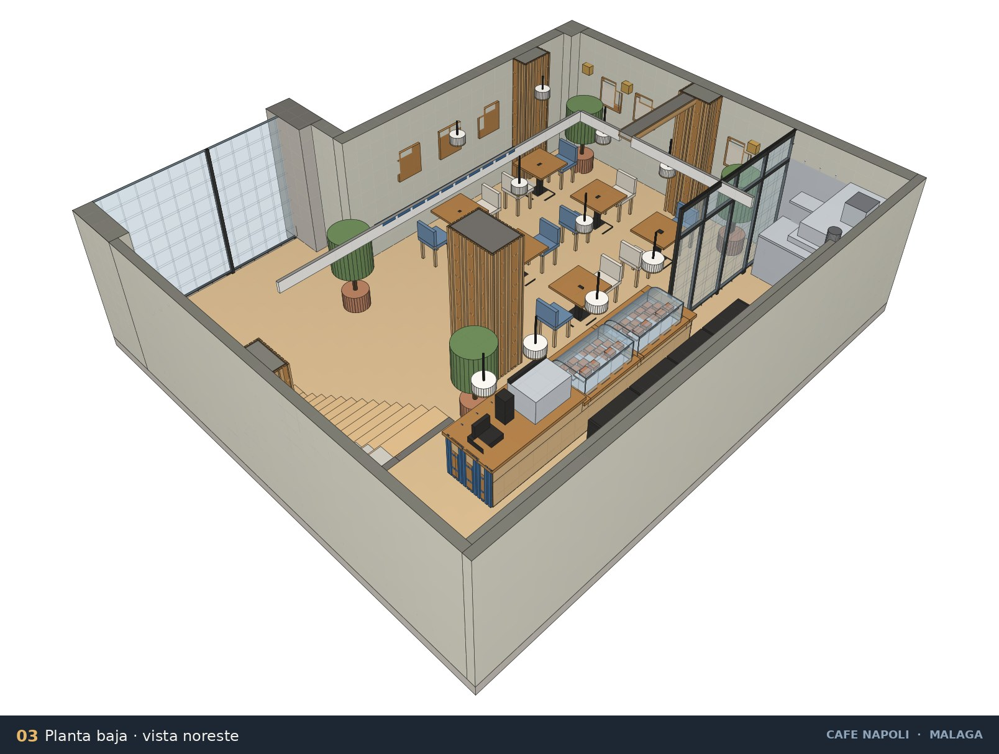
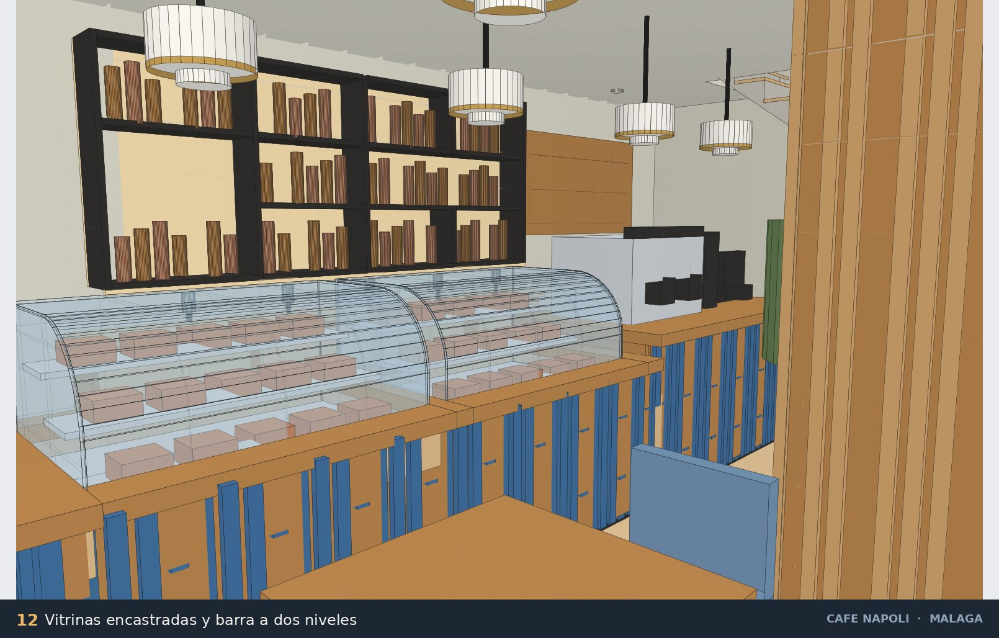
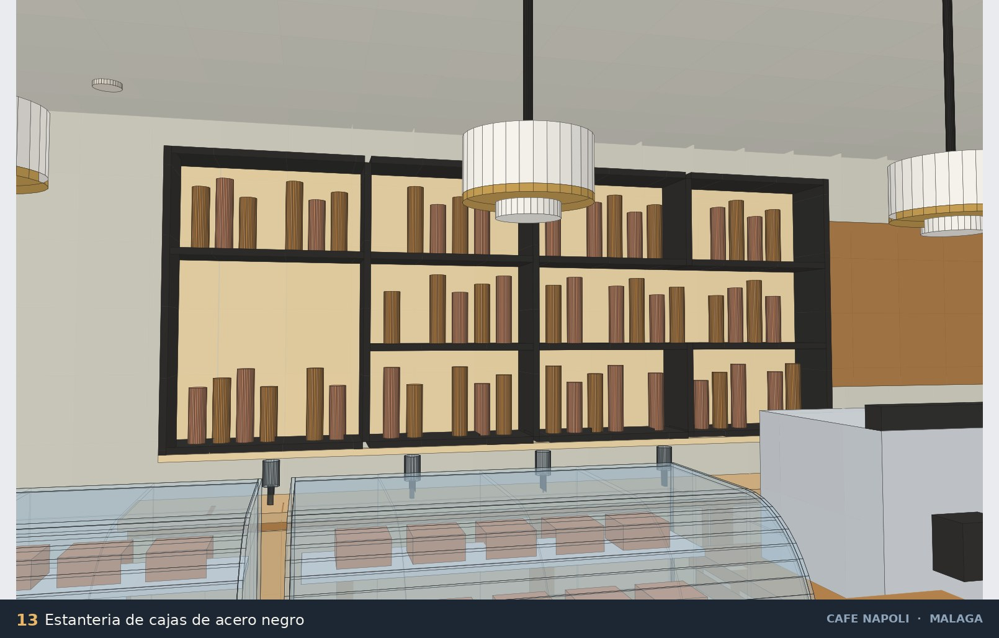
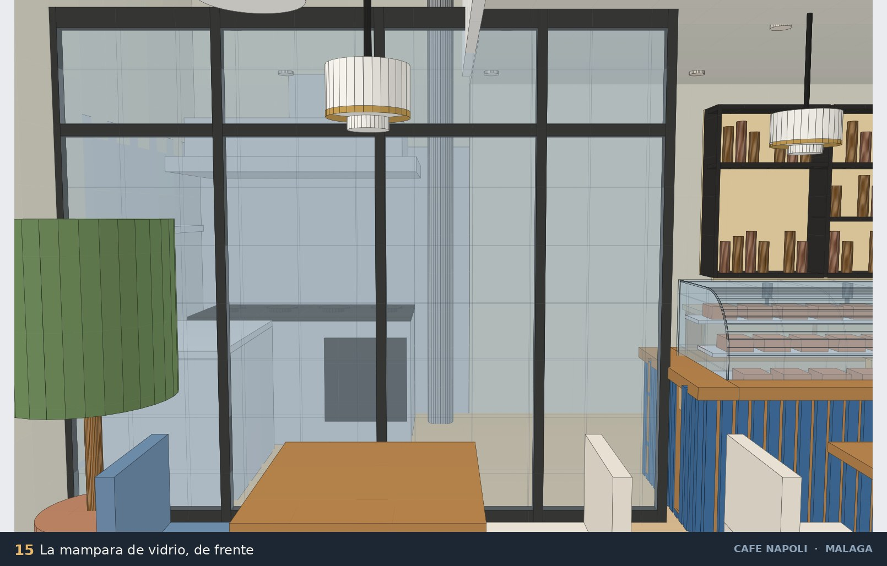

# Café Napoli — Málaga · Modelo 3D para SketchUp

Generador en Ruby (`cafe_napoli_malaga.rb`) que construye el local completo
—arquitectura, equipamiento, mobiliario, iluminación y decoración— a partir de
los dos planos entregados.

**648 sólidos** repartidos en **19 etiquetas**. Todo el modelo se levanta con una
sola orden en la Consola Ruby de SketchUp.

|  |  |
|---|---|
|  |  |
|  |  |

Quince puntos de vista en `docs/vistas/` y una lámina resumen en `docs/`.

## Render fotorrealista

Además de las vistas de trabajo, `docs/render/` contiene **siete renders
fotorrealistas** de la planta baja hechos con **Blender (Cycles)** a partir de
la misma geometría que genera el script: suelo de roble claro, paredes en
*light gray* #DAD8C9, maderas cálidas, frente de barra en azul Napoli, acero
inoxidable, vidrio y latón, con las lámparas de pantalla ópalo encendidas, la
estantería retroiluminada y atrezzo real —tazas, platillos, jarrones con
flores, bollería en las vitrinas y botellas de vidrio en la estantería—.

La escena se construye con `blender_scene.py` (incluido en el repositorio)
leyendo la geometría exportada del generador, así que renders y modelo de
SketchUp están siempre sincronizados.

---

## Cómo usarlo

1. Abre SketchUp con un modelo **nuevo y vacío**.
2. `Ventana ▸ Consola Ruby` (*Window ▸ Ruby Console*).
3. Escribe la ruta y pulsa Intro:

   ```ruby
   load "C:/ruta/al/cafe_napoli_malaga.rb"                 # Windows
   load "/Users/tu_usuario/.../cafe_napoli_malaga.rb"      # macOS
   ```

Para regenerarlo: `CafeNapoliMalaga.build!`
También se instala el menú **Extensiones ▸ Café Napoli ▸ Generar modelo 3D**.
El script fija las unidades en metros y encuadra una vista axonométrica.

---

## Qué contiene

### Arquitectura — medida sobre los planos

| Etiqueta | Contenido |
|---|---|
| `01 Solera` | Solera de 0,20 m bajo toda la huella |
| `02 Muros perimetrales` | Medianeras norte y este, muro oeste, muro sur, muro del cuello y trasdosado |
| `03 Pilares y machones` | Pilar central, pilar de fachada, machón oeste, machón este, pilastra sur y viga descolgada |
| `04 Forjado planta alta` | Forjado a +3.00 con el vacío y el hueco de escalera recortados |
| `05 Cubierta` | Forjado de cubierta (etiqueta oculta por defecto) |
| `06 Particiones planta alta` | Aseo, cabina de inodoro y almacén-2, con sus tres huecos de paso |
| `07 Particiones planta baja` | Recinto de cocina con su hueco de paso |
| `08 Escalera` | Losa de 16 huellas y 17 tabicas, partida para esquivar el machón este |
| `09 Barandillas` | Antepechos de vidrio de 5 cm en las tres aristas del hueco |
| `10 Fachada - escaparate` | Acristalamiento con su montante, cercos, banda de rótulo y peto |
| `11 Instalaciones` | Bajante Ø 0,20 grafiada en el rincón noroeste |

### Interiorismo

| Etiqueta | Contenido |
|---|---|
| `20 Pavimento` | Roble claro en planta baja y en el altillo |
| `21 Cocina` | Bloque de cocción de 4 fuegos con horno, campana extractora, mesa de trabajo y estante mural. **Paramentos de acero inoxidable** en el muro de la cocina y en el de su izquierda, hasta 2,20 m |
| `22 Barra` | Estructura corrida de 4,53 m **a dos niveles**: el mostrador de las vitrinas está 0,12 m más bajo (tabla a 0,86 m) que el de la cafetera y la caja (0,98 m), con el frente del desnivel forrado de madera y la tabla alta volando 3 cm sobre él. Zócalo retranqueado negro, frente de **listones azul Napoli** y **tabla de madera maciza** por encima |
| `23 Vitrinas y equipos` | Dos **vitrinas de cristal curvo** —refrigerada y caliente— **encastradas en el mostrador bajo**, con 2 cm de holgura por los cuatro lados: la bandeja queda 0,22 m por debajo de su tabla y la coronación del cristal sólo 0,30 m por encima. Tres baldas escalonadas dentro. El cristal se genera de una pieza y se entrega con las aristas de la curva **suavizadas** (`soft` + `smooth`), de modo que en SketchUp se ve como una superficie continua, sin el rayado de las facetas. Máquina de café, molinillo y caja, sobre el mostrador alto |
| `24 Estanteria` | Mueble bajo liso de roble con cuatro puertas y encimera, y encima una **rejilla de acero negro que forma diez cajas de distinto tamaño** sobre un fondo retroiluminado en cálido, con línea de luz bajo la rejilla. 2,48 m de coronación |
| `25 Revestimiento de madera` | Listones verticales cubriendo **los cuatro lados** de cada soporte, **de suelo a techo**: pilar central y machón este hasta el intradós del forjado (2,70 m), machón oeste y pilastra sur —que están en la doble altura— hasta los 5,50 m. Forro de la viga descolgada y frente del altillo |
| `26 Mesas y sillas` | 6 mesas de 0,75 × 0,75 y 12 sillas tapizadas, alternando **tela crema y tela azul** |
| `27 Iluminacion` | 12 colgantes de pantalla ópalo con aro de latón (4 sobre la barra, 6 sobre las mesas y 2 altos en la entrada), 13 empotrados en el intradós del forjado y 3 apliques de latón en el muro oeste |
| `28 Decoracion` | 4 plantas en maceta de terracota, 6 cuadros y pizarra de carta |

Cada elemento es un grupo con nombre descriptivo, seleccionable desde el Outliner.

### La entrada va vacía

El cuello de fachada —desde el escaparate hasta la línea del muro sur,
y = 1,810 m— **no lleva nada en el suelo**: ni mesas, ni banco, ni plantas.
Lo único que hay son dos colgantes altos a 2,90 m, colgados del techo de la
doble altura. La mesa más adelantada arranca en y = 2,275 m, a 1,90 m del
escaparate.

### Separación entre mesas

| Holgura | Valor |
|---|---|
| Respaldo más cercano ↔ muro oeste | **0,91 m** |
| Entre ejes de columna | 2,15 m |
| Libre entre respaldos de mesas contiguas | 0,47 m |
| Entre filas | 1,50 / 1,45 m |
| Mesa más al norte ↔ canto de la barra | 0,49 m |

Las tres mesas que había al este de la sala se han retirado: esa mitad queda
como zona de paso libre entre la entrada, la barra y la escalera.

### Mampara de cristal

El cerramiento de la cocina hacia la sala es una **mampara de vidrio de 3,18 m**
(`PB Mampara …`, etiqueta `07 Particiones planta baja`): arranca en el muro
oeste, en x = 0,251, y muere exactamente donde empieza la barra, en x = 3,430.

Es **un solo paño de vidrio** con un **borde exterior de 4 cm** y nada por
dentro: sin montantes ni travesaños intermedios.

**Corona a 2,40 m**, por debajo del frente del altillo —que arranca a 2,48 m—
y del intradós del forjado —2,70 m—, de modo que no la corta nada de la
planta primera.



La cocina no tiene puerta al comedor: se entra por detrás de la barra, desde el
office.

### Paleta

| Uso | Color |
|---|---|
| Muros | `#DAD8C9` |
| Pavimento | roble claro `#D8BA8F` |
| Maderas cálidas (barra, estantería, listones) | `#C99E69` / `#B2804A` |
| Acento azul Napoli (frente de barra, rótulo) | `#3E6B99` |
| Tapicerías | crema `#E7DFD1` y azul `#6C8AA8` |
| Pantallas ópalo · latón | `#F6F3EC` · `#C69E54` |
| Rejilla de la estantería · fondo retroiluminado | `#302F2D` · `#F6DEAE` |

---

## De dónde sale cada medida

Ninguna cota de la arquitectura es inventada: toda la geometría se ha medido
**sobre los vectores de los PDF** y convertido a metros con la escala real de
cada documento.

| Documento | Contenido | Escala | Factor |
|---|---|---|---|
| `planimetria_2.pdf` | PLANTA ALTA + perímetro del local | **1:50** | 56,6929 pt/m |
| `PROPOSTA_MALAGA.pdf` | PLANTA BAJA | **1:30** | 94,4882 pt/m |

### Escalas validadas contra las cotas rotuladas

| Comprobación | Modelo | Plano |
|---|---|---|
| ASEO | 3,92 m² | 3,90 m² |
| ALMACÉN-2 | 2,59 m² | 2,60 m² |
| Huella de peldaño | 0,260 m | 16 huellas grafiadas |
| Recorrido de escalera | 4,159 m | 16 × 0,26 = 4,16 m |
| Cotas de la propuesta | 2,721 / 1,880 / 1,345 m | «272» / «188» / «134,5» |

### Los dos planos encajan entre sí

| Elemento | Planimetría | Propuesta | Δ |
|---|---|---|---|
| Pilastra del muro sur (X) | 1,3000 m | 1,3003 m | 0,3 mm |
| Pilastra del muro sur (Y) | 2,1078 m | 2,1089 m | 1,1 mm |
| Machón del muro oeste (Y) | 5,3569 m | 5,3580 m | 1,1 mm |
| Cara interior del muro sur | 1,8098 m | 1,8083 m | 1,5 mm |

---

## Sistema de coordenadas

```
X = 0   cara exterior del muro OESTE        X = 10,040   medianera ESTE
Y = 0   punto más al sur (pilar fachada)    Y =  9,156   medianera NORTE
Z = 0   planta baja                         Z =  3,000   planta alta (+3.00)
```

Huella exterior **81,73 m²** · útil de planta baja **74,20 m²** · forjado de planta alta **33,74 m²**.

---

## Verificación

El generador se ejecuta contra un *stub* de la API de SketchUp y se comprueba
geométricamente antes de entregarlo:

| Prueba | Resultado |
|---|---|
| Sólidos generados | 648, ninguno degenerado, todos con material y etiqueta |
| Cotas contra el plano | 22 comprobaciones, todas dentro de tolerancia |
| **Solape entre sólidos de estructura** | **0,0000 m³** sobre 102,367 m³ (rejilla volumétrica de 5 cm) |
| **Huecos en la envolvente** | **0,0000 m²** a z = 0,30 / 1,50 / 2,50 / 3,50 / 4,50 / 5,30 m |
| Interferencia mobiliario ↔ estructura | Sin colisiones. Los cuatro pares que marca el filtro por cajas envolventes —listones del machón este contra la escalera— se descartan con rejilla exacta de 1 cm: 0 celdas compartidas |
| Solape real entre elementos de interiorismo | Ninguno. Los únicos que quedan son intencionados: mobiliario apoyado sobre los 2 cm de pavimento y las baldas dentro de las vitrinas |
| Superposición sobre el PDF | Cada elemento de la arquitectura cae sobre su trazado original |

Las vistas de este README están generadas a partir de la geometría que produce el
script, con aristas y sección horizontal, tal como se ve en SketchUp.

---

## Cotas que los planos NO dan

El plano sólo acota el nivel **+3.00**. La arquitectura que falta está agrupada
como constantes al principio del archivo: se cambia el número y se vuelve a
ejecutar `build!`.

| Constante | Valor | Criterio |
|---|---|---|
| `H_PA` | 3,00 m | **Cota del plano (+3.00)** |
| `T_FORJADO` | 0,30 m | Deja 2,70 m libres bajo el forjado |
| `H_LIBRE_PA` | 2,50 m | Altura libre en planta alta → cubierta a +5,50 |
| `H_PUERTA` | 2,10 m | Estándar |
| `H_BARANDA` | 1,00 m | Estándar |
| `H_ESCAPARATE` | 3,00 m | Se alinea con el nivel +3.00; rótulo encima |
| `Z_VIGA_INF` | 2,60 m | Intradós de la viga descolgada |
| `T_ZANCA` | 0,20 m | Canto de la losa de escalera |

El mobiliario y el equipamiento **no vienen acotados en los planos**: se han
dimensionado con medidas de uso corriente y encajado dentro de la huella medida.
Los valores están al principio de cada método (`BAR_X0`, `BAR_H`, `mesas_sala`,
`iluminacion`…), de modo que mover una mesa o cambiar la altura de la barra es
editar una línea.

**Única libertad tomada en la arquitectura:** la propuesta dibuja el recinto de
cocina cerrado, sin ningún hueco (es un plano de equipamiento, no de
arquitectura). Se ha abierto un paso de 0,80 m en el tabique sur, en la
prolongación exacta del pasillo de servicio. Se mueve en `particiones_pb()`.
