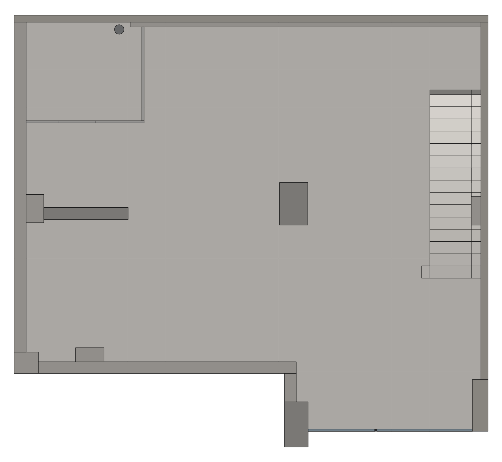
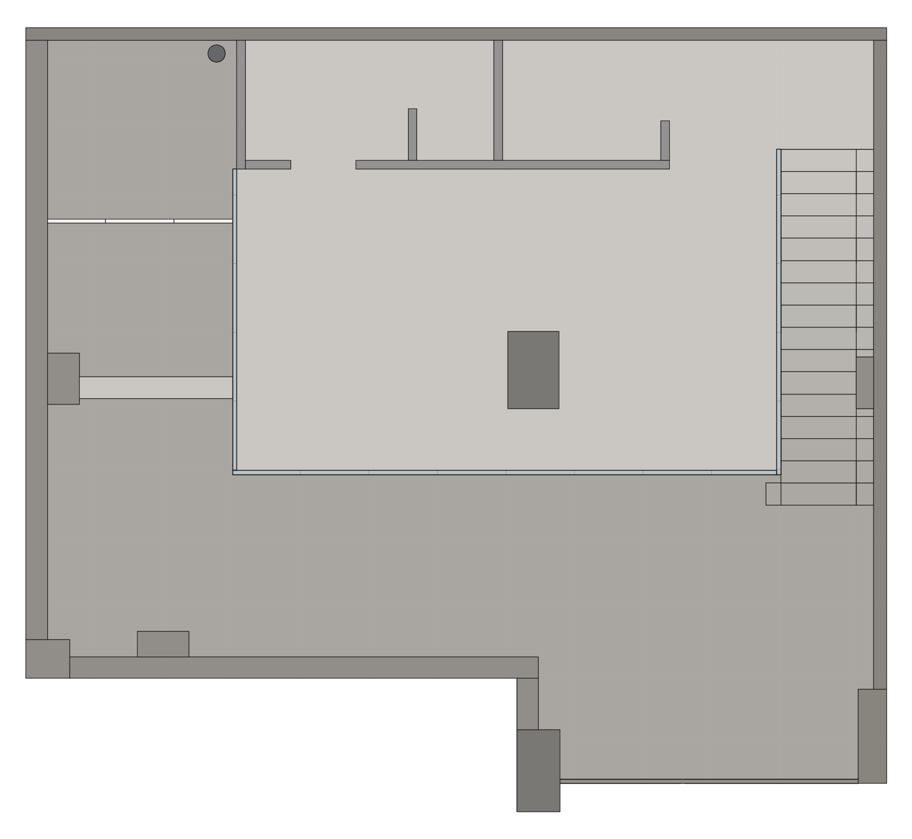
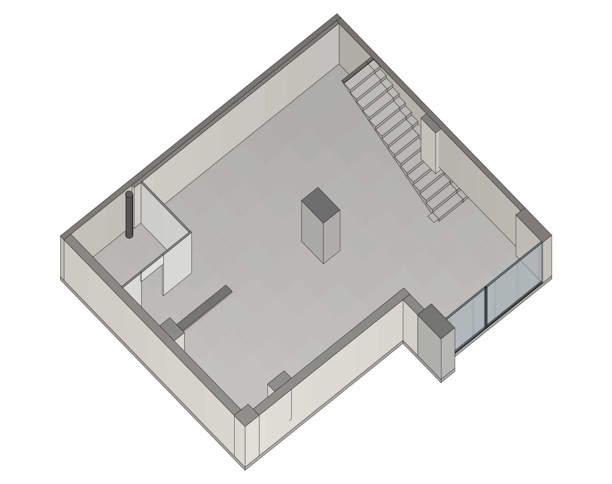
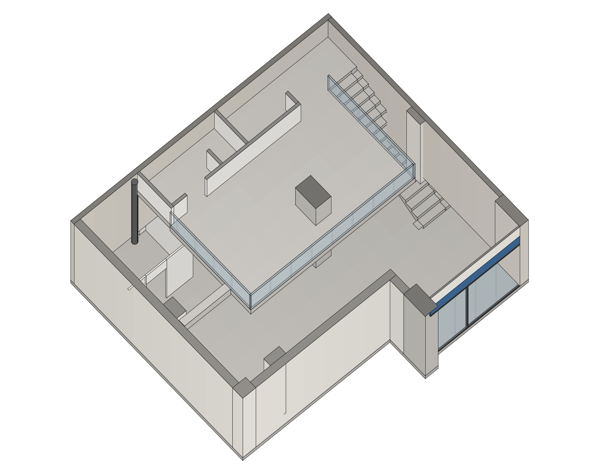
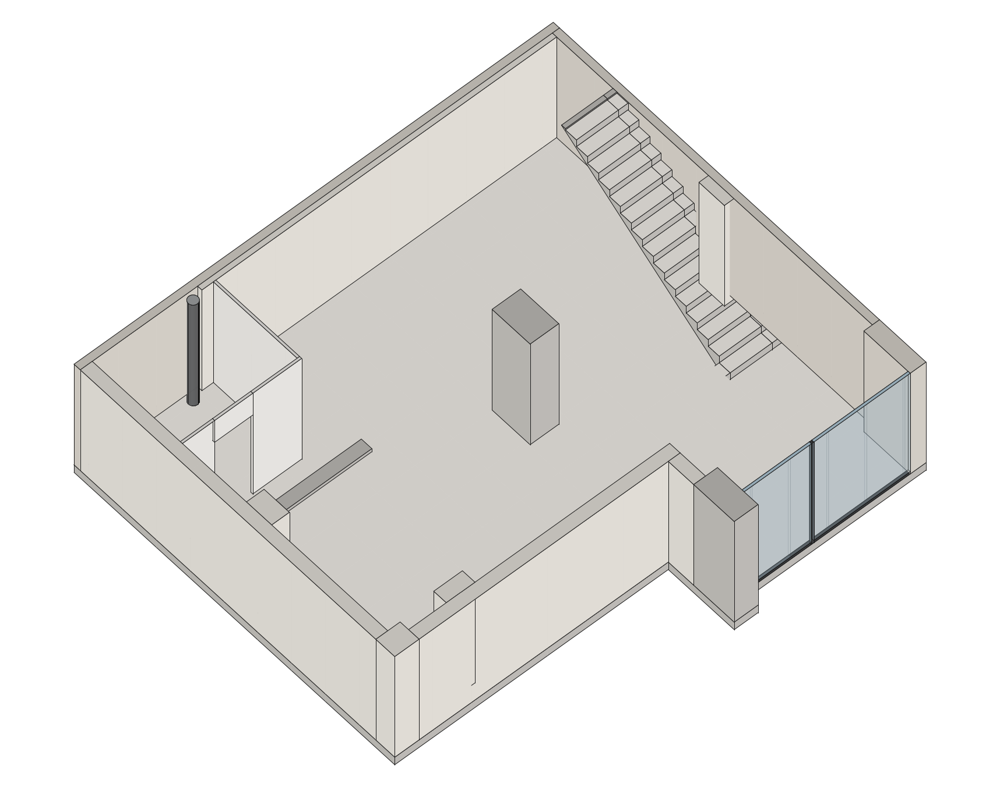
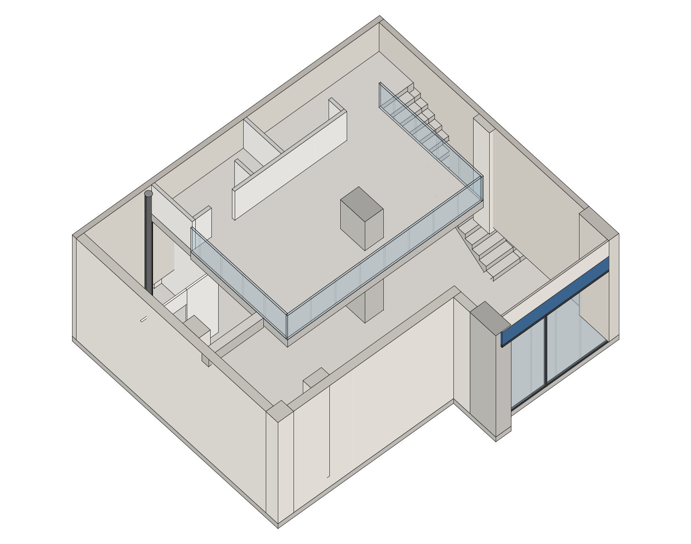
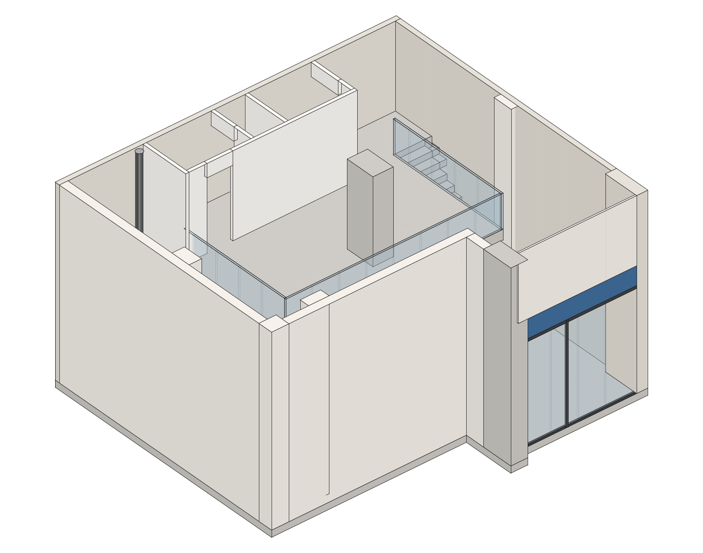
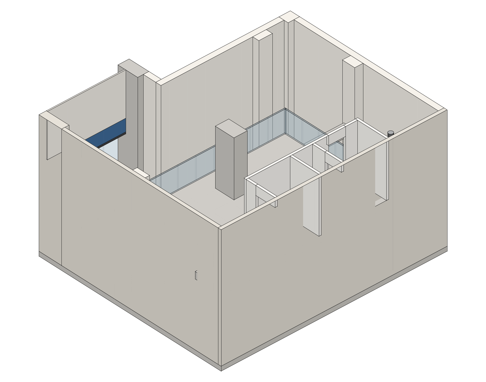
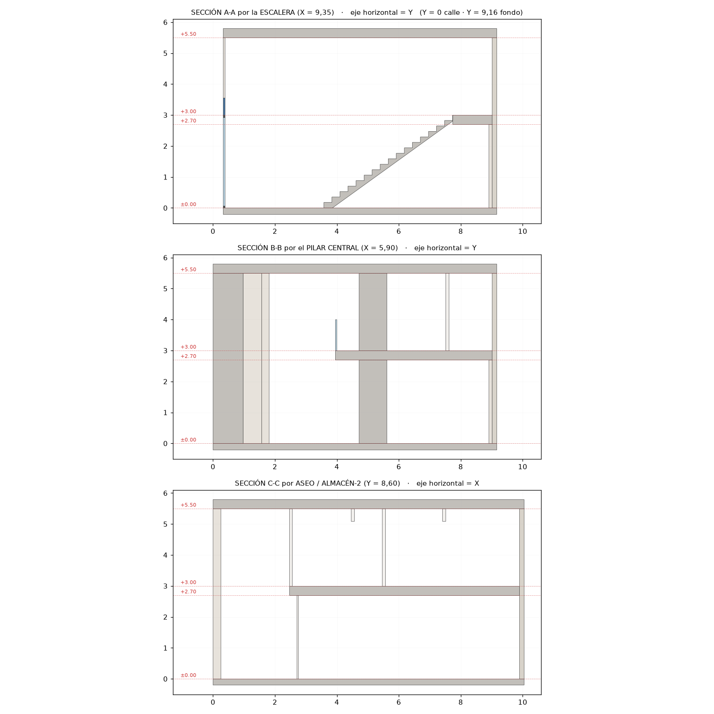

# Café Napoli — Málaga · Modelo estructural 3D para SketchUp

Generador en Ruby (`cafe_napoli_malaga.rb`) que construye la caja arquitectónica
completa del local —planta baja y planta alta— a partir de los dos planos entregados.

**Sólo estructura.** Sin mobiliario ni equipamiento de ningún tipo.

| | |
|---|---|
|  |  |
|  |  |
|  |  |
|  |  |

---

## Cómo usarlo

1. Abre SketchUp con un modelo **nuevo y vacío**.
2. `Ventana ▸ Consola Ruby` (*Window ▸ Ruby Console*).
3. Escribe la ruta y pulsa Intro:

   ```ruby
   load "C:/ruta/al/cafe_napoli_malaga.rb"                 # Windows
   load "/Users/tu_usuario/.../cafe_napoli_malaga.rb"      # macOS
   ```

Para regenerarlo: `CafeNapoliMalaga.build!`
También se instala el menú **Extensiones ▸ Café Napoli ▸ Generar modelo 3D**.
El script fija las unidades en metros y encuadra una vista axonométrica.

---

## Qué contiene

| Etiqueta | Contenido |
|---|---|
| `01 Solera` | Solera de 0,20 m bajo toda la huella |
| `02 Muros perimetrales` | Medianeras norte y este, muro oeste, muro sur, muro del cuello y trasdosado |
| `03 Pilares y machones` | **Pilar central**, pilar de fachada, machón oeste, **machón este**, pilastra sur y viga descolgada |
| `04 Forjado planta alta` | Forjado a +3.00 con el vacío y el hueco de escalera recortados |
| `05 Cubierta` | Forjado de cubierta (etiqueta oculta por defecto) |
| `06 Particiones planta alta` | Aseo, cabina de inodoro y almacén-2, con sus tres huecos de paso |
| `07 Particiones planta baja` | Recinto de cocina con su hueco de paso |
| `08 Escalera` | Losa de 16 huellas y 17 tabicas, partida para esquivar el machón este |
| `09 Barandillas` | Antepechos de vidrio de 5 cm en las tres aristas del hueco |
| `10 Fachada - escaparate` | Acristalamiento con su montante, cercos, banda de rótulo y peto |
| `11 Instalaciones` | Bajante Ø 0,20 grafiada en el rincón noroeste |

Cada elemento es un grupo con nombre descriptivo, seleccionable desde el Outliner.

---

## De dónde sale cada medida

Ninguna cota es inventada: toda la geometría se ha medido **sobre los vectores de
los PDF** y convertido a metros con la escala real de cada documento.

| Documento | Contenido | Escala | Factor |
|---|---|---|---|
| `planimetria_2.pdf` | PLANTA ALTA + perímetro del local | **1:50** | 56,6929 pt/m |
| `PROPOSTA_MALAGA.pdf` | PLANTA BAJA | **1:30** | 94,4882 pt/m |

### Escalas validadas contra las cotas rotuladas

| Comprobación | Modelo | Plano |
|---|---|---|
| ASEO | 3,92 m² | 3,90 m² |
| ALMACÉN-2 | 2,59 m² | 2,60 m² |
| Huella de peldaño | 0,260 m | 16 huellas grafiadas |
| Recorrido de escalera | 4,159 m | 16 × 0,26 = 4,16 m |
| Cotas de la propuesta | 2,721 / 1,880 / 1,345 m | «272» / «188» / «134,5» |

### Los dos planos encajan entre sí

| Elemento | Planimetría | Propuesta | Δ |
|---|---|---|---|
| Pilastra del muro sur (X) | 1,3000 m | 1,3003 m | 0,3 mm |
| Pilastra del muro sur (Y) | 2,1078 m | 2,1089 m | 1,1 mm |
| Machón del muro oeste (Y) | 5,3569 m | 5,3580 m | 1,1 mm |
| Cara interior del muro sur | 1,8098 m | 1,8083 m | 1,5 mm |

---

## Sistema de coordenadas

```
X = 0   cara exterior del muro OESTE        X = 10,040   medianera ESTE
Y = 0   punto más al sur (pilar fachada)    Y =  9,156   medianera NORTE
Z = 0   planta baja                         Z =  3,000   planta alta (+3.00)
```

Huella exterior **81,73 m²** · útil de planta baja **74,20 m²** · forjado de planta alta **33,74 m²**.



---

## Verificación

El generador se ejecuta contra un *stub* de la API de SketchUp y se comprueba
geométricamente antes de entregarlo:

| Prueba | Resultado |
|---|---|
| Sólidos generados | 48, ninguno degenerado, todos con material y etiqueta |
| Cotas contra el plano | 22 comprobaciones, todas dentro de tolerancia |
| **Solape entre sólidos** | **0,0000 m³** sobre 102,57 m³ (rejilla volumétrica de 5 cm) |
| **Huecos en la envolvente** | **0,0000 m²** a z = 0,30 / 1,50 / 2,50 / 3,50 / 4,50 / 5,30 m |
| Superposición sobre el PDF | Cada elemento cae sobre su trazado original |

Las vistas de este README están generadas a partir de la geometría que produce el
script, con proyección paralela y aristas, tal como se ve en SketchUp.

---

## Cotas que los planos NO dan

El plano sólo acota el nivel **+3.00**. El resto está agrupado como constantes al
principio del archivo: se cambia el número y se vuelve a ejecutar `build!`.

| Constante | Valor | Criterio |
|---|---|---|
| `H_PA` | 3,00 m | **Cota del plano (+3.00)** |
| `T_FORJADO` | 0,30 m | Deja 2,70 m libres bajo el forjado |
| `H_LIBRE_PA` | 2,50 m | Altura libre en planta alta → cubierta a +5,50 |
| `H_PUERTA` | 2,10 m | Estándar |
| `H_BARANDA` | 1,00 m | Estándar |
| `H_ESCAPARATE` | 3,00 m | Se alinea con el nivel +3.00; rótulo encima |
| `Z_VIGA_INF` | 2,60 m | Intradós de la viga descolgada |
| `T_ZANCA` | 0,20 m | Canto de la losa de escalera |

**Única libertad tomada:** la propuesta dibuja el recinto de cocina cerrado, sin
ningún hueco (es un plano de equipamiento, no de arquitectura). Se ha abierto un
paso de 0,80 m en el tabique sur, en la prolongación exacta del pasillo de
servicio. Se mueve en `particiones_pb()`.
