# Café Napoli — Málaga · Modelo 3D para SketchUp

Generador en Ruby (`cafe_napoli_malaga.rb`) que construye el modelo 3D completo del local
—planta baja y planta alta— a partir de los dos planos entregados.

| | |
|---|---|
| 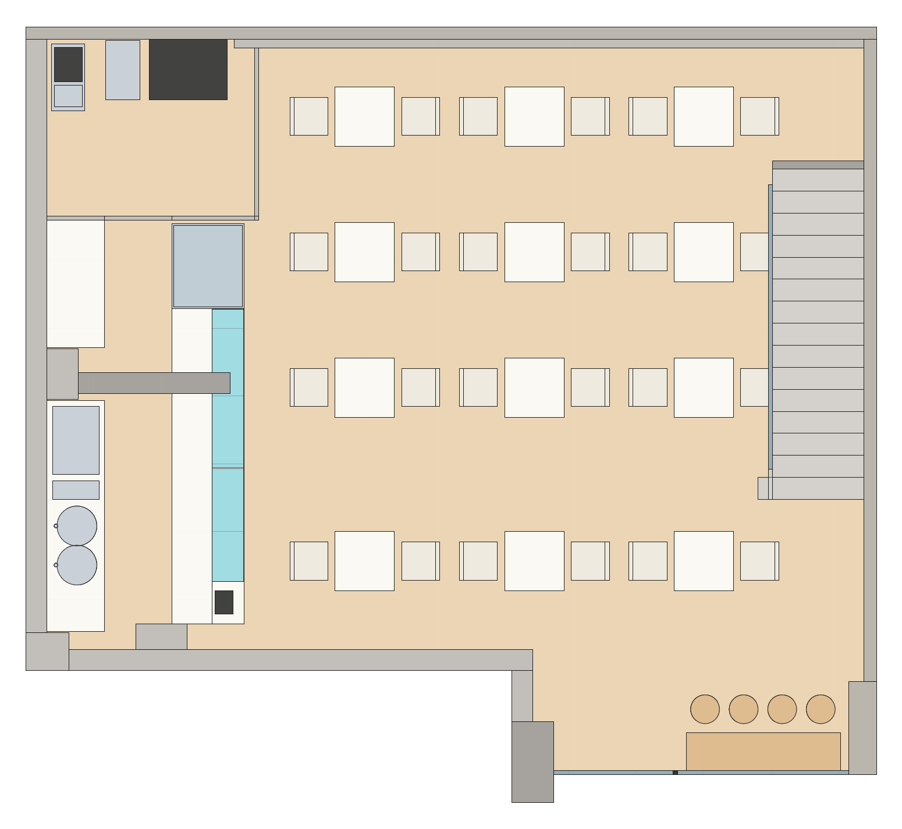 | 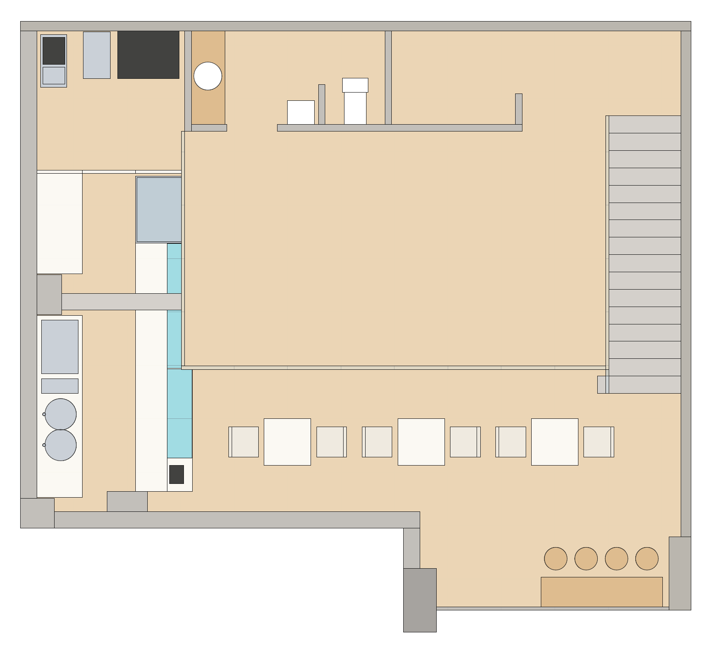 |
| 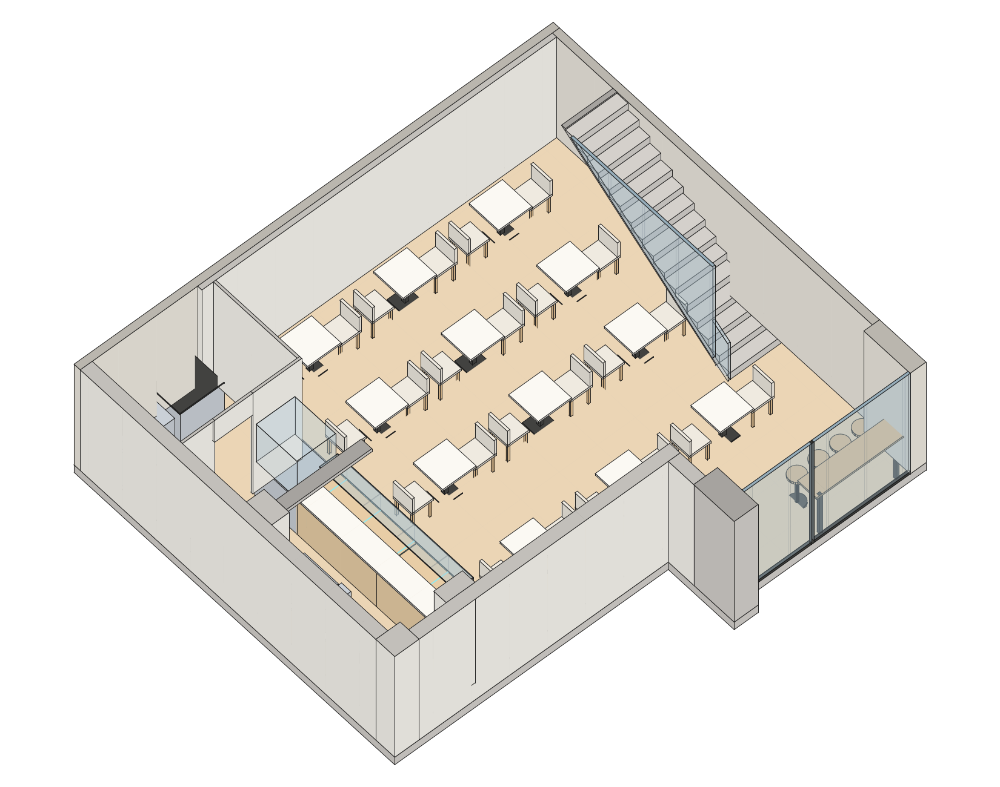 | 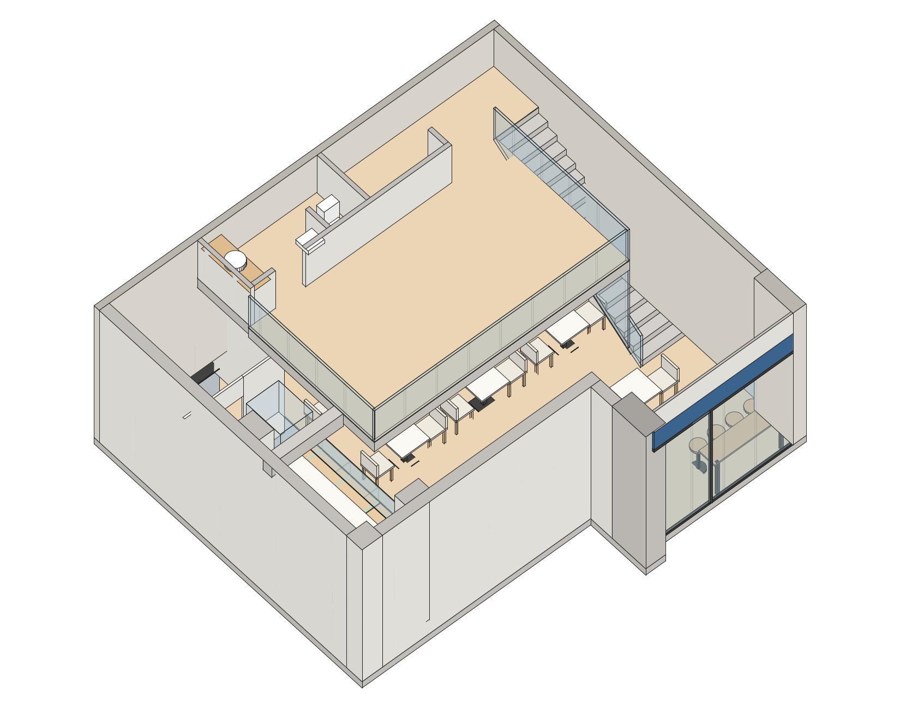 |
| 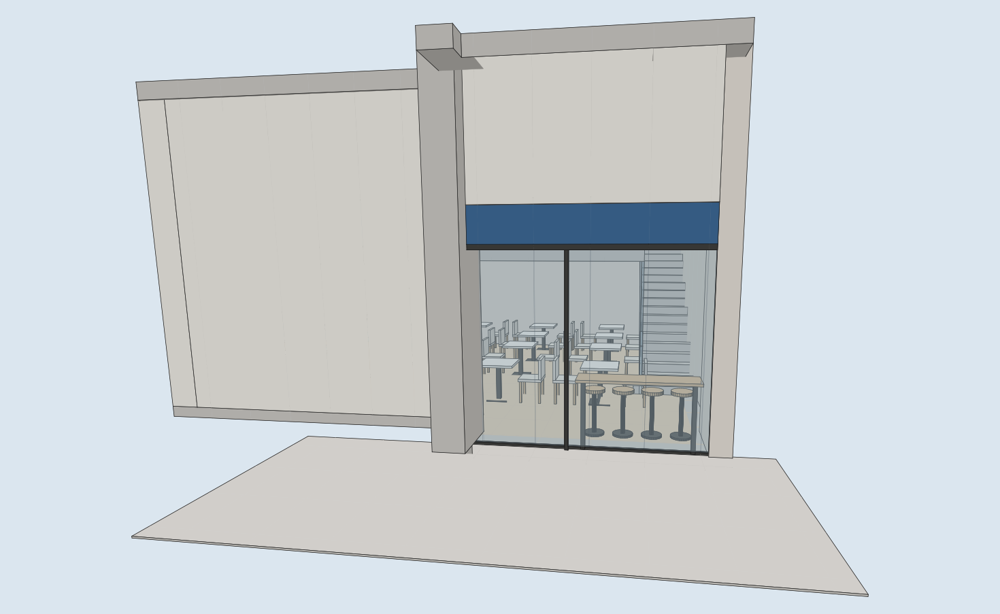 | 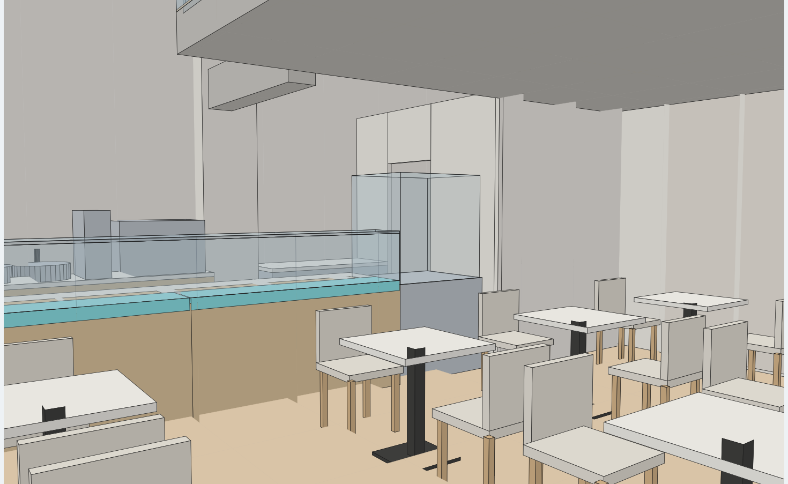 |
| 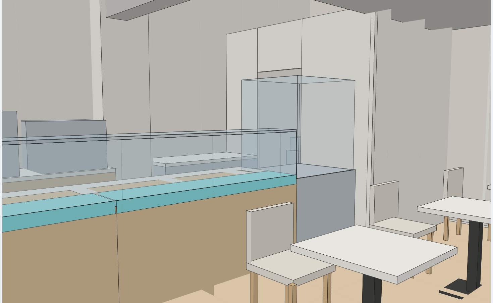 | 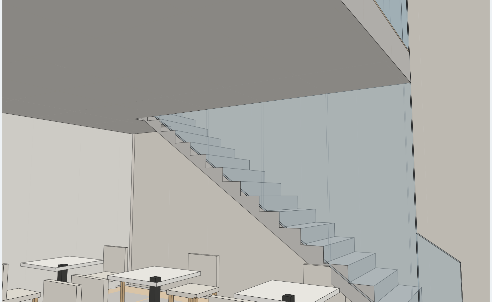 |
| 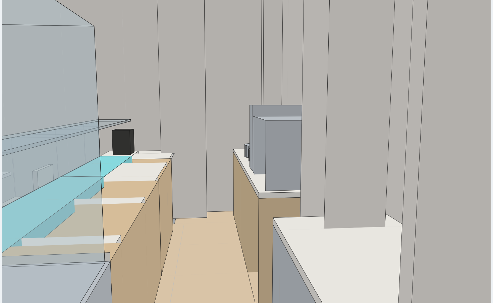 | 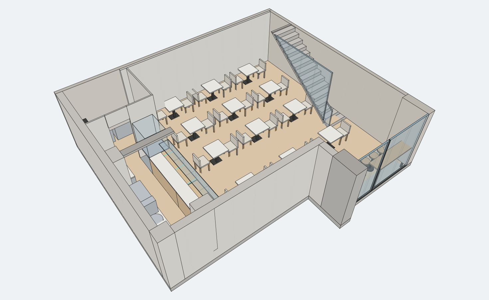 |

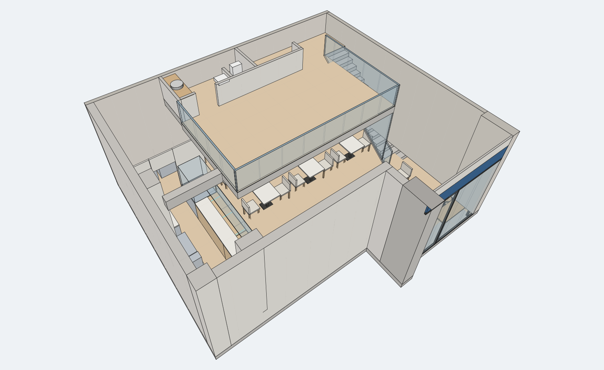

---

## Cómo usarlo

1. Abre SketchUp con un modelo **nuevo y vacío**.
2. `Ventana ▸ Consola Ruby` (*Window ▸ Ruby Console*).
3. Escribe la ruta del archivo y pulsa Intro:

   ```ruby
   load "C:/ruta/al/cafe_napoli_malaga.rb"     # Windows
   load "/Users/tu_usuario/.../cafe_napoli_malaga.rb"   # macOS
   ```

4. El modelo se genera al instante. Para regenerarlo:

   ```ruby
   CafeNapoliMalaga.build!
   ```

También se instala el menú **Extensiones ▸ Café Napoli ▸ Generar modelo 3D**.
Si copias el archivo a la carpeta `Plugins` de SketchUp, sólo se instala el menú
(no se genera nada al arrancar).

El script fija las unidades del modelo en **metros** y deja una vista axonométrica encuadrada.

---

## De dónde sale cada medida

Ninguna cota es inventada: toda la geometría se ha medido **sobre los vectores de los PDF**
y se ha convertido a metros con la escala real de cada documento.

| Documento | Contenido | Escala detectada | Factor |
|---|---|---|---|
| `planimetria_2.pdf` | PLANTA ALTA + perímetro del local | **1:50** | 56,6929 pt/m |
| `PROPOSTA_MALAGA.pdf` | PLANTA BAJA (cocina, barra, mostrador) | **1:30** | 94,4882 pt/m |

### Verificación de la escala contra las cotas rotuladas

| Comprobación | Modelo | Plano |
|---|---|---|
| ASEO | 3,92 m² | 3,90 m² |
| ALMACÉN-2 | 2,59 m² | 2,60 m² |
| Trasbarra (cota «272») | 2,721 m | 2,72 m |
| Drop-in (cota «188») | 1,880 m | 1,88 m |
| Drop-in (cota «134,5») | 1,345 m | 1,345 m |
| Huella de peldaño | 0,260 m | 16 huellas dibujadas |
| Recorrido de escalera | 4,159 m | 16 × 0,26 = 4,16 m |

### Los dos planos encajan entre sí

Los elementos que aparecen en ambos documentos coinciden al milímetro, lo que confirma
que las escalas y el origen común son correctos:

| Elemento | Desde la planimetría | Desde la propuesta | Δ |
|---|---|---|---|
| Pilastra del muro sur (X) | 1,3000 m | 1,3003 m | 0,3 mm |
| Pilastra del muro sur (Y) | 2,1078 m | 2,1089 m | 1,1 mm |
| Machón del muro oeste (Y) | 5,3569 m | 5,3580 m | 1,1 mm |
| Cara interior del muro sur | 1,8098 m | 1,8083 m | 1,5 mm |

---

## Sistema de coordenadas

```
X = 0       cara exterior del muro OESTE        X = 10,040   medianera ESTE
Y = 0       punto más al sur (pilar de fachada) Y =  9,156   medianera NORTE
Z = 0       nivel de planta baja                Z =  3,000   nivel planta alta (+3.00)
```

Superficies resultantes: **huella exterior 81,73 m²**, **superficie útil de planta baja 74,20 m²**,
**forjado de planta alta 33,74 m²**.

---

## Qué contiene el modelo

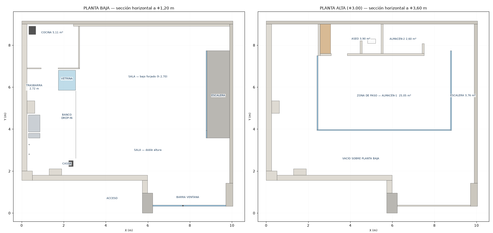

### Estructura y cerramientos
- Medianeras norte (0,148 m) y este (0,150 m; 0,330 m en el cuello de fachada).
- Muro oeste (0,250 m) con su **machón** (Y 3,80–4,40) y muro sur (0,249 m) con su **pilastra** (X 1,300–1,901).
- **Pilar de fachada** de 0,499 × 0,960 m en la esquina del escaparate.
- **Viga descolgada** de 0,25 m grafiada en la planimetría, del machón oeste al borde del forjado.
- Trasdosado de 0,10 m que la propuesta dibuja bajo el forjado, a partir de X = 2,46.
- Escalonamiento del perímetro en la esquina SO, tal como está dibujado.

### Planta alta (+3.00)
- Forjado con el **VACÍO SOBRE PLANTA BAJA** y el hueco de escalera recortados.
- **ASEO** (3,90 m²) con encimera de lavabos de 0,50 × 1,40, lavabo mural e inodoro en cabina propia.
- **ALMACÉN-2** (2,60 m²).
- **ZONA DE PASO – ALMACÉN-1** (25,05 m²).
- Huecos de paso con sus anchos reales: aseo 0,76 m · cabina de inodoro 0,80 m · almacén 0,94 m.
- Barandillas de vidrio de 5 cm siguiendo exactamente la línea del plano.

### Escalera (3,76 m²)
16 huellas de 0,26 m y **17 tabicas de 3,00/17 = 0,1765 m**, que es justo lo que exige la cota
+3.00 con las huellas dibujadas. Losa inclinada, peldaño de arranque ensanchado y barandilla
de vidrio con base siguiendo el peldañeado.

### Planta baja
- **Cocina** (5,11 m²) con tabiques de 5 cm y los tres equipos acotados:
  mueble microondas/tostadora (0,40 × 0,80), **FREIDORA** (0,40 × 0,70), **PLANCHA** (0,92 × 0,71).
- **Trasbarra**: RETRO REFRIGGERATO norte (0,675 × 1,50) y trasbarra sur de **2,72 m**
  con MACCHINA CAFFÈ, molino y los **dos senos circulares de Ø 0,47** del plano.
- **Mostrador** de 0,849 m de fondo y 3,72 m de largo:
  VETRINA EXPO ALTA (FREDDA) 0,85 × 1,00 · DROP IN CLDO FREDDO de **1,88 m** y **1,345 m**
  en la franja de 0,379 m del lado del cliente · BANCO CASSA de 0,50 m.
- **Escaparate** con el montante en su posición real, banda de rótulo y peto.
- Pasillo de servicio de **0,80 m** entre trasbarra y mostrador.

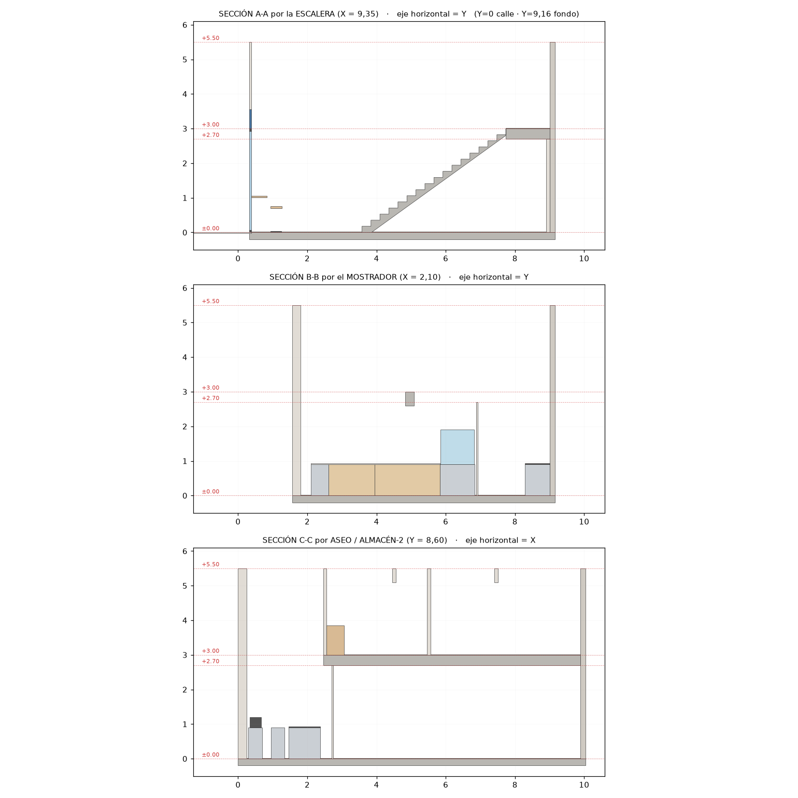

---

## Cotas que los planos NO dan (y cómo se han resuelto)

Los planos sólo acotan el nivel **+3.00**. El resto se ha deducido de lo que el propio dibujo
impone o de medidas estándar coherentes con él. **Todas están agrupadas como constantes al
principio del archivo**, así que basta cambiar el número y volver a ejecutar `build!`:

| Constante | Valor | Criterio |
|---|---|---|
| `H_PA` | 3,00 m | **Cota del plano (+3.00)** |
| `T_FORJADO` | 0,30 m | Canto habitual; deja 2,70 m libres bajo el forjado |
| `H_LIBRE_PA` | 2,50 m | Altura libre en planta alta → cubierta a +5,50 |
| `H_PUERTA` | 2,10 m | Estándar |
| `H_BARANDA` | 1,00 m | Estándar |
| `H_MOSTRADOR` | 0,90 m | Altura de trabajo; encimera a 0,94 |
| `H_VITRINA` | 1,90 m | «VETRINA EXPO **ALTA**» |
| `H_ESCAPARATE` | 3,00 m | Se alinea con el nivel +3.00; rótulo encima |
| `Z_VIGA_INF` | 2,60 m | Intradós de la viga descolgada |

Dos decisiones más que conviene conocer:

- **Puerta de la cocina.** La propuesta dibuja el recinto de cocina **cerrado, sin ningún hueco**
  (es un plano de equipamiento, no de arquitectura). Se ha abierto un paso de 0,80 m en el
  tabique sur, exactamente en la prolongación del pasillo de servicio, que es donde
  geométricamente tiene que estar. Si el hueco real está en otro sitio, se mueve en
  `cocina()`.
- **Mobiliario de sala.** Los planos no grafían mesas ni sillas. Se ha añadido una propuesta
  (12 mesas de 0,70 × 0,70 con 24 sillas + barra de ventana con 4 taburetes) **en su propia
  etiqueta**, `12 Mobiliario sala (propuesta)`, para poder ocultarla o borrarla de un clic
  sin tocar nada más.

---

## Etiquetas (capas) del modelo

```
00 Terreno y acera              07 Barandillas vidrio
01 Solera y pavimentos          08 Fachada - escaparate
02 Muros y pilares              09 Cocina - equipamiento
03 Forjado planta alta          10 Barra y mostrador
04 Cubierta   (oculta)          11 Sanitarios
05 Particiones planta alta      12 Mobiliario sala (propuesta)
06 Escalera
```

Cada elemento es un grupo con nombre descriptivo, así que se pueden seleccionar, mover o
editar uno a uno desde el Outliner.

---

## Verificación

El generador se ha ejecutado contra un *stub* de la API de SketchUp para comprobar,
antes de entregarlo, que:

- se crean **273 sólidos**, ninguno degenerado y todos con material y etiqueta;
- las 20 comprobaciones dimensionales contra las cotas del plano salen correctas;
- ningún elemento de mobiliario invade muros ni queda fuera del perímetro interior.

Las plantas, secciones y vistas de este README están generadas **a partir de la geometría
real que produce el script**, no dibujadas aparte: `docs/plantas.png`, `docs/secciones.png`,
`docs/vistas.png` y las once vistas de `docs/renders/` (vista superior e isométrica
seccionada de cada planta, más siete perspectivas), todas con aristas y proyección
paralela al estilo de SketchUp.
